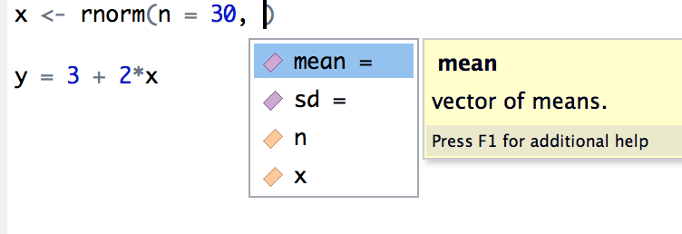
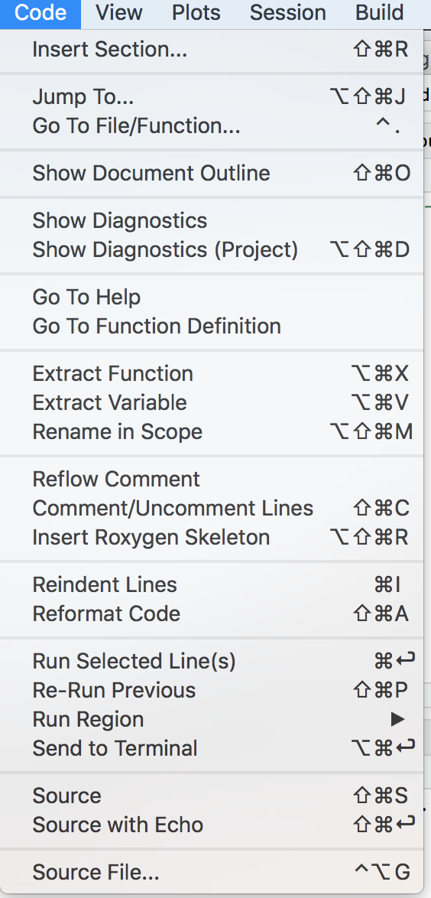
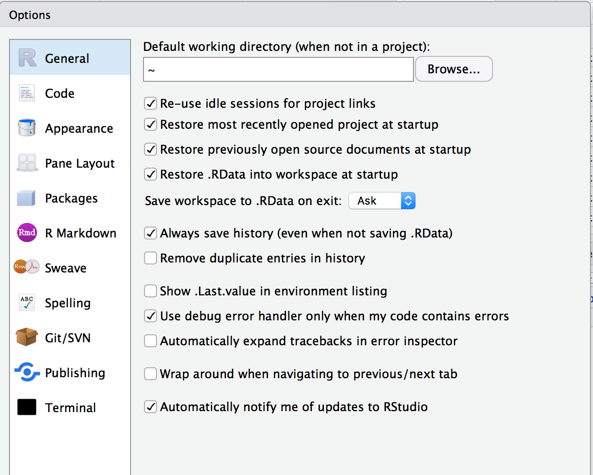
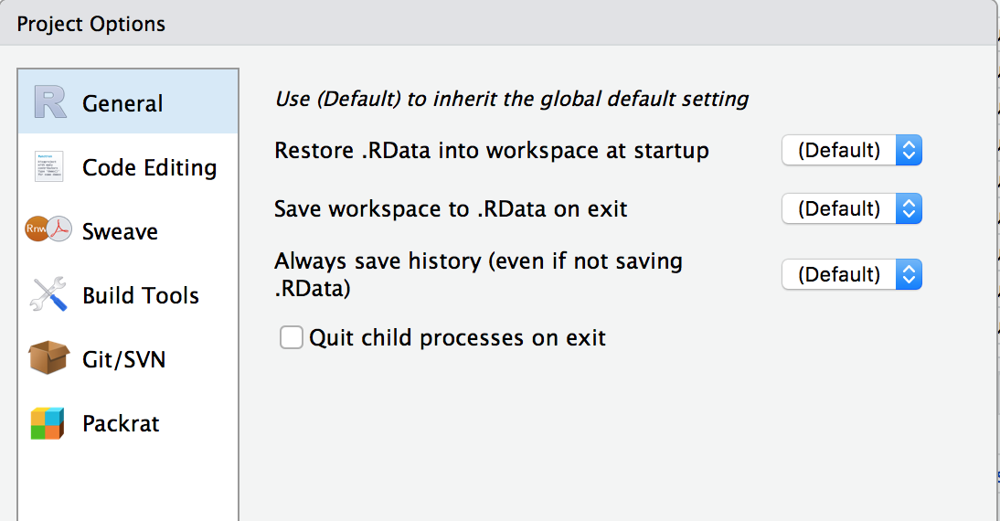

```{r setup, cache = F, echo = F, message = F, warning = F, tidy = F}
# make this an external chunk that can be included in any file
library(knitr)
options(width = 100)
opts_chunk$set(eval=T, results = 'markup', include=T, message = F, error = F, warning = F, comment = NA, fig.align = 'center', dpi = 100, tidy = F, cache.path = '.cache/', fig.path = 'fig/')

options(xtable.type = 'html')
# knit_hooks$set(inline = function(x) {
#   if(is.numeric(x)) {
#     round(x, getOption('digits'))
#   } else {
#     paste(as.character(x), collapse = ', ')
#   }
# })
knit_hooks$set(plot = knitr:::hook_plot_html)
```

## IDEs

* Goal: **Make coding/data analysis easier**
* Content:
  * Text editor with syntax highlighting
  * Compiler or interpreter
  * Debugger
  * Lots of other *little* things easier, e.g. version control, file manager, console, terminal, autocomplete...

---

## IDE examples

* For `R` there is [R Studio](https://www.rstudio.com/) 
* For `Python` there is [PyCharm](https://www.jetbrains.com/pycharm/)
* For general purpose there is [Sublime Text](https://www.sublimetext.com/). There are lots of others!
* For datascience type applications, the [Jupyter](http://jupyter.org/) project is powerful. 

---&twocol

## RStudio - projects

*** =left
* `.RData` - a snapshot of your workspace
* `.RHistory` - a history of commands you ran in text
* `MyProject.RProj` - project level settings for RStudio
* File templates: R scripts, RMarkdown, plain text, C++, R Presentation...
* `Console`: Run R commands from a terminal
* `Terminal`: run bash commands from a terminal

*** =right
* `Environment`: view all objects in various environments
* `History`: list of previously run commands
* `Git`: manage your version control
* `Files`: view and manage your files. 
* `Plots/Viewer`: view plots and other output (e.g. html documents)
* `Packages`: manage packages

---&twocol

## Writing code

*** =left

* LOTS of commands to make writing code easier in `Code` menu
* **Most useful** is `tab` complete: 

```{r, echo=F, out.width='100%'}

```

* Debugger is also very useful


*** =right


```{r, echo=F, out.width='50%'}

```

---&twocol

## Customize RStudio

*** =left

```{r, echo=F,out.width='100%'}

```

*** =right

```{r, echo=F, out.width='100%'}

```

---

## Exercises

1. Configure your RStudio with the following layout: 
  1. Bottom left: `Console` and `Terminal`
  2. Top left: `Source`
  3. Top right: `Environment`, `History`, `VCS`
  4. Bottom right: `Files`, `Plots`, `Packages`, `Help`, `Viewer`

2. Check the 'Options'> 'RMarkdown': What directory are code chunks evaluted in?  Can you change this? What does this mean?

3. Look in the 'History' pane - try and run a previous command in the console without typing it out. 
